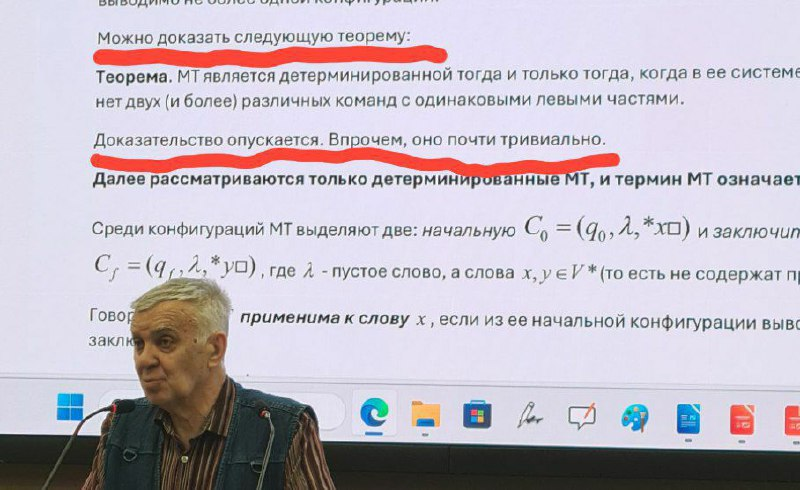

# Дискретная математика (ЛИТЫ)

**Основная инфа**
---

- Лектор и семинарист - Белоусов Алексей Иванович

Старая-добрая дискра. В сущности, как и в прошлом семе: 2 дз и 2 рк, разве что экзамена нет. От второго рк можно (И НУЖНО) освободиться.

**Рекомендации**
---

- ТОТАЛЬНАЯ ПОСЕЩАЕМОСТЬ. Никогда не пропускайте лекции и семинары, НИКОГДА.

- АВТОМАТ ЗА РК2 ЛЮБОЙ ЦЕНОЙ. Нужно сделать оба дз вовремя, успешно написать рк1 (можно пересдавать, но в определенный срок).

***
