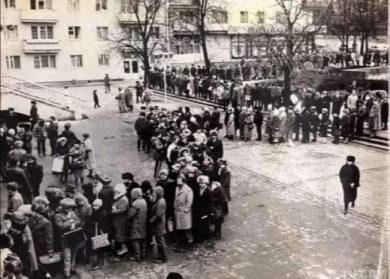

# 4th_semester_BMSTU

*Ну вот и всё, сказки кончились, начался 4 семак)*

***В этом репозитории есть: готовый код, полезная литература для сдачи лаб и экзаменов, а также полезные ссылки на материалы.***

**Основная инфа**
---

В этом семестре вас ждёт большое количество лаб. Вы будете тратить всё свое время на них, даже стоя в очереди на сдачу одной лабораторной, вы будете уже писать код для другой. Но на самом деле, самое сложное именно СДАТЬ лабу.

В этом семестре всего три экзаменационных предмета:

- Компьютерная графика (aka КГ)     *10 лаб*
- Объектно-ориентированное программирование (aka ООП) *5 лаб*
- Машинно-зависимые языки программирования (aka МЗЯП) *12 лаб*

Но также лабы есть и по этим предметам:

- Вычислительные алгоритмы (aka Вычалги) *6 лаб*
- Архитектура ЭВМ (aka АрхЭВМ, aka Электроника Advanced) *3 лабы*

Всего: 10+5+12+6+3 = **36 лабораторных работ**

**Рекомендации**
---

- Лабы по ООП делайте и сдавайте до их выдачи. Тассов очень опаздывает по лекциям, поэтому в 2025 году он даже не успел выдать 5 лабу). Также чем ближе к концу семестра, тем Тассов более придирчив к лабам.

- Для КГ учите алгоритмы, описанные в Роджерсе. 

- Наберитесь терпения. Вам ещё в очередях стоять)

***
Удачи, у вас всё получится! =)

